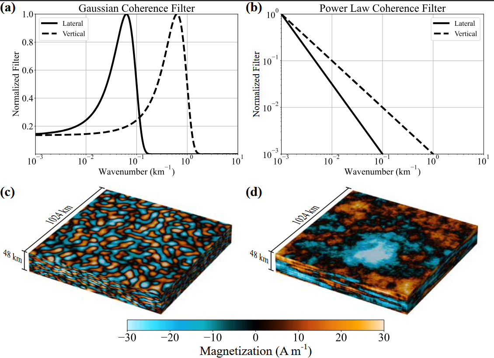
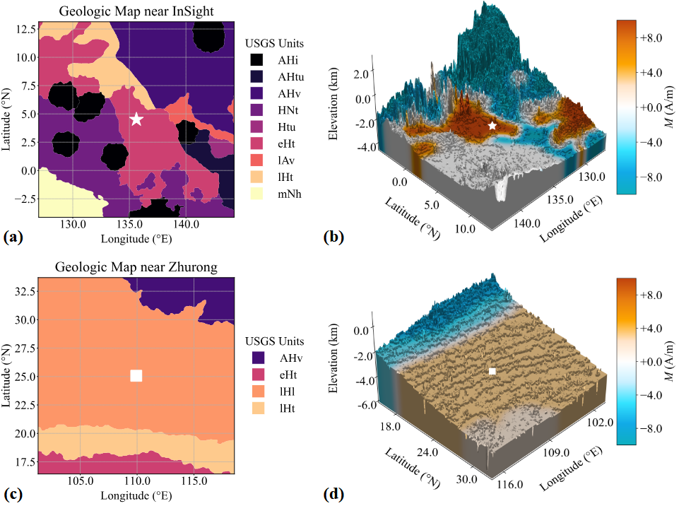

# Martian Magpy

  

## A Python module to perform Monte Carlo simulations of crustal magnetization grids and magnetic field altitude profiles above planetary surfaces

  
  
<em>Figure 1:</em> Example of normalized coherence filters in the Fourier domain based on a (a) Gaussian and (b) power law distribution. The lateral and vertical Gaussian filters have a peak coherence wavelength of 100 and 10 km, respectively, with a width equal to half of the peak wavelength. The lateral and vertical power law filters are generated with powers of 1.5 and 1.0, respectively. A magnetized 3D grid is then generated with dimensions 1024 x 1024 x 48 km and spatial resolutions of 2 and 1 km in the lateral and vertical directions, respectively. Each voxel in the grid is randomly assigned a magnetization strength from a Gaussian distribution centered on zero with a width of 10 A/m, where negative values correspond to anti-parallel vectors to the set magnetic field direction. The coherence filters are later applied to each magnetization distribution in wavenumber space for each dimension individually. To obtain the final coherent magnetization distribution from a (c) Gaussian and (d) power law filter, the inverse Fourier transform is performed to the space domain.

  
    
<em>Figure 2:</em> Geological maps derived from Tanaka et al. 2014, near (a) InSight (white star) and (c) Zhurong (white square). Each map is 1024 x 1024 km in horizontal extent. An example of the corresponding magnetization grids, which also account for local elevation, are shown for (b) InSight (white star) and (d) Zhurong (white square). The magnetization for each region was selected on a scale of +/- 10 A/m and spatially filtered to smooth the magnetic field near unit boundaries.

